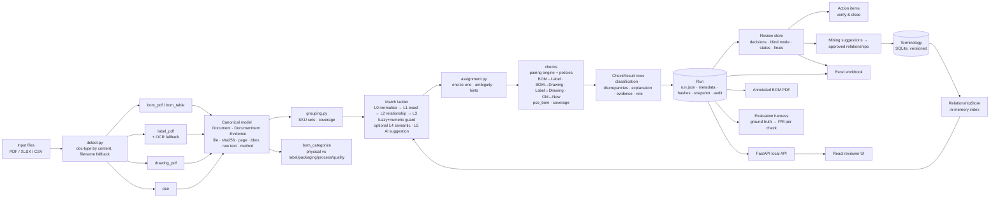

# Final architecture

Kaizen Cross-Check is a deterministic, explainable, traceable cross-check engine with an optional AI assist.
It runs entirely on the reviewer's machine: files in → typed results → reviewer decisions → Excel/PDF out.

## End-to-end data flow

## Transitions and their guarantees

| Transition | Where | Guarantee |
|---|---|---|
| file → doc type | `ingest/detect.py` | Content sniff first, filename tokens second; unknown types are listed in run metadata, never silently dropped. |
| doc → canonical | `ingest/*.py` | Every item keeps file, SHA-256, page, bbox, raw text, locator and extraction method; parser name/version recorded on the document. |
| canonical → comparable set | `bom_categorize.py`, `checks/bom_label.py` | Rule file with reasons; excluded lines are listed on the Documents sheet. Duplicate item rows are merged with evidence of both. |
| text → normalised | `matching/normalize.py` | Deterministic, versioned (`NORMALIZER_VERSION`), tested table-driven. |
| pair → outcome | `matching/ladder.py` | First rung that answers wins; every outcome has a reason; fuzzy/semantic/AI can never be EXACT or EQUIVALENT. |
| outcomes → pairs | `matching/assignment.py` | One-to-one by level then score; alternatives within the delta become AMBIGUOUS_MATCH; unmatched sides keep the closest candidate as a hint. |
| pairs → rows | `checks/pairing.py` + policies | Quantity policy, missing-type policy, soft/exempt categories, conditional callouts; explanation composed from the outcome reason plus quantity verdict. |
| PCO → rows | `checks/pco_bom.py` | Coverage rows precede comparison; ADD/DELETE/SUBSTITUTE/MODIFY evaluated against active BOM rows, redline-aware. |
| old/new → changes | `checks/label_revision.py` | Semantic diff; expectations from PCOs; strict satisfaction test for "already applied". |
| rows → run | `pipeline.py` | Run id derived from input hashes + terminology snapshot + thresholds; capabilities and AI provider recorded. |
| run → review | `review/store.py` | Decisions stored beside engine rows; state machine; history engine → r1 → r2 → final; blind mode enforced server-side. |
| review → terminology | `api` save-as-relationship, `review/mining.py` | Provenance `learned`, created_by reviewer, notes cite run/row; next run uses it via the repository store. |
| run → resolution | `review/action_items.py` | Comparison key = check + SKU + A-side identity (item number or normalised text); resolution requires the SKU to be covered and no discrepancy on the key. |
| run → workbook | `reporting/excel.py` | Engine columns never edited; review columns merged; metadata sheet answers "where did this come from". |
| run → annotated PDF | `reporting/annotated_bom.py` | Marks only in the margin; spreadsheet sources get a review page instead of guessed positions. |
| run → metrics | `evaluation/harness.py` | Hand-declared ground truth; P/R per discrepancy type and per check; disagreements listed in words. |

## Design decisions (and why)

- **Deterministic core, AI assist.** Judges must be able to reproduce every classification. AI (L5) is opt-in,
  only annotates, and is recorded in metadata. Semantic (L4) is a plug-in with an injectable embedder.
- **Relationships are data, not weights.** Versioned SQLite rows with provenance; runs pin the versions they
  used and can reconstruct them after edits or deletes.
- **One pairing engine, five policies.** Presence/identity checks differ by policy, not by code.
- **Roles on rows** (`item/header/reference/coverage/exempt/change`) let the UI, workbook and harness treat
  header-level and exempt rows correctly without string matching.
- **Synthetic but faithful data.** Renderers reproduce the layouts in the brief so parsers are layout-aware,
  and the dataset is byte-stable so evaluations are reproducible.

## Audit findings from the final trace
- No circular imports (checks → matching → terminology → models; api → review/reporting → pipeline).
- No hidden global state except the categorisation rule cache (`lru_cache`) and the API's run cache (per process).
- No silent failures in parsers: every skipped page or unparsed row produces a warning that reaches the run,
  the Summary sheet and the API.
- Evidence references were verified end-to-end by the API test (`page`, `bbox` rendered as a highlight).
- Hard-coded demo assumptions: none in the engine; the demo loader only points at the golden dataset.
