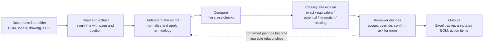

# Kaizen Cross-Check, explained simply

*A plain-language guide to the problem we were given and how we solved it. Written for anyone: judges,
problem owners, reviewers, managers and teammates. No engineering background needed.*

---

## 1. The problem we were given

BD makes medical kits. Every kit has a **SKU** (a product code) and, behind it, four documents that must all
tell the same story:

| Document | Where it comes from | What it says |
|---|---|---|
| **BOM** (Bill of Materials) | JDE, the ERP system | The list of parts that go into the kit, with quantities |
| **Label** | MasterControl | What is printed on the box: "1 Each - Towel, Absorbent", "10 Each - Gauze ..." |
| **Packaging drawing** | Engineering | A picture of the kit with every part called out, in English and Spanish |
| **PCO** (Product Change Order) | MasterControl | The approved list of changes: add this part, delete that one, change a quantity |

When a change project touches a product family, every affected SKU must be **cross-checked**: does the label
list the same parts as the BOM, in the same quantities? Does the drawing show them all? Was every change on
the PCO actually applied to the BOM? Did anything change on the new label that was *not* approved?

Today two people do this by eye. A BOM facilitator and an independent reviewer open the PDFs side by side,
compare line by line, annotate with coloured ticks, stamp "checked by" and keep a separate tracker
spreadsheet for traceability.

The brief gives the cost:

| From the brief | Figure |
|---|---|
| Time per SKU, per reviewer | about 60 minutes |
| Example project | 129 SKUs, so roughly 258 reviewer hours |
| Independent reviewer availability | about 4 hours a day |
| Target | cut the effort by half, about 100 hours and $75,000 a year |

The hard part is not reading. It is that the documents use **different words for the same thing**. The BOM
says `TAPE ANCHOR PER-Q-CATH`. The label says `Tape Strips (3 per)`. The drawing says `SURGICAL TAPE`. A
human knows these are one part. A simple text comparison does not.

## 2. What was asked for

The brief lists five things that any solution must do:

1. **Extract and compare** the content of BOMs, labels, drawings and PCOs, from PDF and Excel.
2. **Match contextually**: recognise equivalent terminology using relationships that people can define.
3. **Classify** every comparison as exact, equivalent, potential, mismatch or missing, and flag discrepancies.
4. **Keep the reviewer in charge**: the tool recommends, a person validates.
5. **Produce a traceable Excel report** showing the values compared, the classification, which relationship
   was used, and what still needs human eyes.

And two hard boundaries: JDE and MasterControl cannot be changed, and the existing approval workflow must
stay as it is.

## 3. Our answer in one sentence

**Kaizen Cross-Check reads the documents reviewers already download, does the line-by-line comparison for
them, explains every conclusion with the exact page and box it came from, and hands the reviewer a short
list of things that genuinely need a human decision, then writes the tracker Excel and the marked-up BOM
automatically.**

Nothing in JDE or MasterControl changes. Files go in, Excel comes out. The reviewer's signature is still the
last step.

## 4. How it works, step by step



**Step 1: Read.** The tool opens each PDF or spreadsheet and pulls out every line: the part number,
description, quantity, and for labels the "N Each - ..." lines. For every value it remembers the file, a
fingerprint of the file (so nobody can swap it later), the page, and the exact rectangle on the page where
the text was found.

**Step 2: Sort out what is a real part.** A BOM contains lines that are not physical parts: the label
itself, packaging allocations, process steps such as "packaging quality". The tool sets these aside as
*exempt* and shows them separately, so they are never wrongly reported as "missing from the label".

**Step 3: Understand the words.** Each description is cleaned up (trademark symbols, units, plurals,
abbreviations) and then looked up in the **terminology relationships**: the tool's dictionary of "these
descriptions mean the same part". Reviewers own this dictionary. They can add, edit, disable, import and
export entries, and each entry can apply everywhere, to one product family, or to one SKU.

**Step 4: Compare.** For each pair of documents the tool pairs up lines using a ladder of methods, from
strictest to loosest:

| Rung | Method | Result it can give |
|---|---|---|
| 1 | Identical text after clean-up | EXACT |
| 2 | A terminology relationship says they are the same | EQUIVALENT |
| 3 | The words are very similar (a score above a threshold) but not confirmed | POTENTIAL, needs a person |
| 4 | Optional AI suggestion | POTENTIAL at most, clearly labelled "AI suggestion" |

Similarity and AI can never produce an EXACT or EQUIVALENT result on their own. Only a person, or a
relationship a person approved, can say two different wordings are the same.

**Step 5: Classify and explain.** Every row gets a classification, a discrepancy type where relevant (for
example quantity mismatch, missing on label, PCO change not applied), a severity, and a one-line explanation
in plain words. Anything the tool is unsure about is marked "needs validation" rather than guessed.

**Step 6: The reviewer decides.** Rows that are exact or equivalent with no discrepancy are pre-cleared.
The reviewer works through the rest and records a decision on each: accept, override, confirm the
discrepancy, or ask for more information. A second reviewer can do the same **blind**, without seeing the
first reviewer's decisions, and the tool reports where they disagree.

**Step 7: Learn, with permission.** When a reviewer confirms that two wordings mean the same part, one click
saves it as a relationship. The next SKU in the family clears that line automatically. The tool also
notices pairings that keep recurring across SKUs and *suggests* new relationships, but a person must approve
each one.

**Step 8: Outputs.** The tool writes the Excel tracker, a copy of the BOM PDF with coloured marks in the
margin, and a list of action items for the problems found. When the corrected documents come back, a rerun
shows which action items are resolved and which remain.

## 5. The five checks, each with an example

| Check | Question it answers | Example of what it catches |
|---|---|---|
| **BOM to Label** | Does the label list every physical part with the right quantity, and the right REF? | BOM says 10 gauze, label says 8. Label shows REF 1275108 but the BOM parent is 1295108. |
| **BOM to Drawing** | Does the drawing call out every part, and does the drawing number and revision match? | A new component was added to the BOM but the drawing was never updated. |
| **Label to Drawing** | Do the label and the drawing agree with each other? | A part on the label has no callout on the drawing. |
| **PCO to BOM** | Was every approved change applied, and does every affected code have a BOM in the batch? | The PCO says delete part X, but X is still active on the BOM. One affected SKU has no BOM in the folder at all. |
| **Old label to New label** | Did only the approved changes happen? | A line silently changed from "1 Each" to "2 Each" with no PCO to justify it. |

A sixth safety net, **coverage**, runs before everything else: if a SKU listed on the PCO has no BOM in the
batch, that is the first thing the reviewer sees, as a blocker.

## 6. Why "contextual matching" matters, and how ours is safe

The single biggest reason manual review is slow is vocabulary. Our approach has three properties the judges
asked about:

- **Relationships are data, not guesses.** Each one records who created it, when, its scope, and a version
  number. Every run records exactly which versions it used, so a result from last month can be reproduced.
- **Scope prevents wrong matches.** A relationship can be tied to a specific item number, so "PICC" in one
  family cannot silently match a different product elsewhere.
- **Suggestions are never silent.** Fuzzy similarity and AI can only propose. A proposal always goes to a
  person, and the Excel shows it as "needs validation".

## 7. The reviewer stays in charge

We built this as an engineering and quality tool, not a chatbot. The system never changes a document, never
approves anything, and never hides a row. Concretely:

- Every decision is stored **next to** the engine's recommendation, never over it. The Excel shows both.
- Two reviewers, independent review, and a clear state for each row: recommended, reviewer 1 done, reviewer
  2 done, agreed, disagreement, finalised.
- Every click is written to an audit log with a timestamp.
- The full evidence is one click away: the page image of the BOM and the page image of the label, with the
  two boxes highlighted, side by side.

## 8. What comes out

**The Excel workbook** has one sheet per check plus supporting sheets: a summary, action items, coverage, a
manual checklist (for the visual checks that cannot be automated, such as the dot sticker location), the
list of documents with their fingerprints, the relationships used, run settings, the audit log and the
measured accuracy. Each row shows the two values compared, the classification, the relationship applied if
any, the discrepancy, the severity, the explanation, where the evidence is, and the reviewer decisions.

**The annotated BOM** is the original BOM PDF with a coloured mark beside every line: green for cleared,
amber for needs validation, red for a discrepancy, one column per check. It replaces the hand-drawn ticks.

**Action items** are generated from the discrepancies, with a reference key. When corrected documents are
run again, the tool matches them up and closes the ones that are fixed.

**A business case sheet** computes hours and dollars from the actual run rather than from a slide.

## 9. How we proved it works

We could not obtain real documents before the build window, so we built a **synthetic test set** that
mirrors the layouts shown in the brief: ten SKU sets, 38 documents, with 30 deliberately planted
discrepancies whose locations we know. Then we measured.

| What we measured | Result |
|---|---|
| Planted discrepancies found | 30 of 30 |
| False alarms | 0 |
| Rows scored across the six checks | 1,049 |
| Rows cleared automatically in the demo set | 82 percent (1,014 of 1,237 reviewable rows) |
| Automated tests in the code base | 361, all passing, run on every code change |
| Speed | 100 SKUs in under 20 seconds on a laptop |

Every code change goes through a continuous integration pipeline on GitHub that reruns all 361 tests on two
Python versions, checks the code style, rebuilds the reviewer screens, and refuses to pass unless the
precision and recall on the test set are both 100 percent.

We also ran an independent, adversarial audit of the whole system from six viewpoints (reviewer, quality
engineer, auditor, developer, problem owner, attacker). It found twelve real weaknesses. All twelve were
fixed, each with a test that would catch it again.

## 10. What it means in hours and dollars

The business case is computed from the run, using the brief's assumptions: 60 minutes per SKU per reviewer,
$37.50 per hour, 100 SKUs per project, 20 projects a year. Two numbers matter, and we show both, clearly
labelled, rather than only the flattering one.

| Scenario | Minutes per SKU | Reduction | Yearly saving |
|---|---|---|---|
| Today (from the brief) | 60 | - | - |
| First run, before any terminology is confirmed | 43.6 | 27 percent | about $41,000 |
| After reviewers confirm the strong pairings as relationships | 16.4 | 73 percent | about $109,000 |

The first run alone does not reach the 50 percent target. The second does, and the tool makes the step
from one to the other a matter of clicks: every confirmed pairing becomes a reusable relationship. These
figures are calculated, not yet observed with real reviewers; validating them is the next step.

## 11. What we deliberately did not do

- **No changes to JDE or MasterControl.** Integration means working on the exact files people already
  download.
- **No automatic approval.** The tool never finalises a row on its own.
- **No AI dependency.** The engine is fully deterministic and works offline. An AI provider can be switched
  on explicitly, but its output is labelled as a suggestion and cannot change a result, a decision or a
  relationship. Turn it off and every result is the same.
- **No sending data anywhere.** Nothing leaves the machine unless someone configures an AI provider.
- **No compliance claims.** We built for traceability and reproducibility; formal validation is a
  separate exercise.

## 12. Honest limitations and what happens next

- **Everything has been tested on synthetic documents.** They copy the layouts in the brief, but a real
  JDE print or MasterControl label may differ. The parsers report what they cannot read rather than
  guessing, but until we run real files we cannot promise the same accuracy. This is the highest-risk item
  and the first thing to do at checkpoint one: get three to five real, redacted sets and re-tune.
- Scanned (image-only) BOMs and drawings and hand-drawn redlines are not read yet. Text-based PDFs and
  spreadsheets are. Label scans fall back to OCR when it is installed.
- Descriptions that JDE cuts off mid-word are matched by similarity, not by a special rule.
- The review database is local and single-user. A shared server with login would be the production step.
- Case labels are not parsed yet, only unit labels.

## 12a. Where the details are

| Question | Document |
|---|---|
| How does each module work? | [`system-description.md`](system-description.md) |
| Why was it designed this way? | [`final-architecture.md`](final-architecture.md) |
| How do I demo it? | [`demo-script.md`](demo-script.md) |
| What are the honest gaps? | [`known-limitations.md`](known-limitations.md), [`security-review.md`](security-review.md) |

## 13. Glossary

| Term | Meaning |
|---|---|
| **BOM** | Bill of Materials: the list of parts in a product, with quantities |
| **SKU** | The code for one sellable product, for example 1295108NS |
| **Product family** | SKUs that share a base number, for example everything starting 1295108 |
| **REF** | The product reference printed on the label; must match the BOM parent item |
| **PCO** | Product Change Order: the approved description of what must change |
| **Redline** | A marked-up change on a document, old value struck through and new value written in |
| **Callout** | A label on a drawing pointing at one part |
| **Oper Seq** | Operation sequence number: the step in assembly where a part is used |
| **Relationship** | A stored fact that two different wordings mean the same part |
| **Classification** | The tool's verdict on one comparison: exact, equivalent, potential, mismatch or missing |
| **Needs validation** | The tool is not certain; a person must look |
| **Blind review** | The second reviewer cannot see the first reviewer's decisions |

## 14. Try it in five minutes

```bash
python3 -m venv .venv && .venv/bin/pip install -e ".[dev]"
.venv/bin/kaizen demo                 # runs the sample set and prints measured accuracy
cd ui && npm ci && npm run build && cd ..
.venv/bin/kaizen serve                # open http://127.0.0.1:8765 and follow docs/demo-script.md
```

The demo script in `docs/demo-script.md` walks through a full review in 25 short steps: the missing BOM
blocker, a contextual match with the evidence side by side, saving a relationship and watching the next
SKU clear, a quantity mismatch, an unapplied PCO delete, a blind second review ending in a disagreement,
the Excel export, the annotated BOM, an action item closed by a corrected rerun, and the business case.
